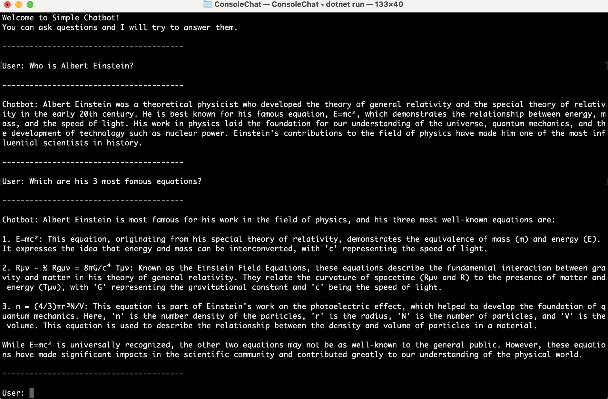

# Console Chatbot Demo (Azure OpenAI Service)

Description: This is a basic chatbot console application using Azure OpenAI client library for .NET (v1.0.0-beta.5) and Azure OpenAI Service deployed Generative AI Model gpt-4.

------------------------------

## Prerequisites:  

### 1. An Azure subscription

### 2. Access granted to Azure OpenAI in the desired Azure subscription.

* Currently, access to this service is granted only by application. You can apply for access to Azure OpenAI by completing the form at https://aka.ms/oai/access.  

After you receive confirmation in the email you provided in the form, navigate to Azure Portal and create the 'Azure OpenAI' resource.

### 3. An Azure OpenAI Service resource with the gpt-4¹ model deployed.

For more information about model deployment, see the [resource deployment guide](https://learn.microsoft.com/en-us/azure/cognitive-services/openai/how-to/create-resource).  

¹ - GPT-4 models are currently only available by request. To access these models, existing Azure OpenAI customers can [apply for access by filling out this form](https://aka.ms/oai/get-gpt4)  

*Reference:*

[Quickstart: Get started using ChatGPT and GPT-4 with Azure OpenAI Service - Prerequisites](https://learn.microsoft.com/en-us/azure/cognitive-services/openai/chatgpt-quickstart?tabs=command-line&pivots=programming-language-csharp#prerequisites)


------------------------------

### 4. Get the deployment name

Log into [Azure OpenAI Studio](https://oai.azure.com/portal) - (sidebar) Management section - Deployments. In the table on the right side - copy the value for the GPT-4 deployment row under the 'Deployment name' column.

### 5. Get the endpoint and key

*Option A:*  

[Open Microsoft Azure Portal](https://portal.azure.com/#home), then click on the Azure OpenAI resource you have created - (sidebar) 'Resource Management' section - 'Keys and Endpoint'.  

KEY 1 - click on 'Copy to clipboard' button on the right side of the key value. Paste the value in a text file temporarily.  

Endpoint - click on 'Copy to clipboard' button on the right side of the endpoint value. Paste the value in a text file temporarily.  

*Reference:*  

[Quickstart: Get started using ChatGPT and GPT-4 with Azure OpenAI Service - Retrieve key and endpoint](https://learn.microsoft.com/en-us/azure/cognitive-services/openai/chatgpt-quickstart?tabs=command-line&pivots=programming-language-csharp#retrieve-key-and-endpoint)  


*Option B:* Open [Azure OpenAI Studio](https://oai.azure.com/portal) - (sidebar) Playground section - Chat. In the 'Configuration' column on the page right-hand side - Deployment tab - Deployment* dropdown - select your GPT-4 Deployment name.  

In 'Chat session' column - click on 'View code'. A 'Sample Code' modal will open - at it's bottom you should see 'Endpoint' and 'Key' fields.  

Endponint - click on 'Copy to clipboard' button on the right side of the value. Paste the value in a text file temporarily.  
Key - click on 'Copy to clipboard' button on the right side of the value. Paste the value in a text file temporarily.  

### 6. Replace endpoint, key and deploymentOrModelName value placeholders in the app

Open ```ConsoleChat/Program.cs``` and replace the variable values:  

```CSharp
string endpoint = "your-azure-openai-service-endpoint-url-here";
string key = "your-azure-openai-service-key-here";

// Enter the deployment name you chose when you deployed the model.
string deploymentOrModelName = "your-deployment-name-here";
```

*Note:* This is just a temporary solution (DO NOT push these changes in public GitHub repository).  

For a safer solution, see:  

[Quickstart: Get started using ChatGPT and GPT-4 with Azure OpenAI Service - Environment variables](https://learn.microsoft.com/en-us/azure/cognitive-services/openai/chatgpt-quickstart?tabs=command-line&pivots=programming-language-csharp#environment-variables)  

### 7. Restore NuGet packages

In Terminal / cmd run: ```dotnet restore```  

### 8. Build the app

Open Terminal - navigate to the Project - run: ```dotnet build```  

### 9. Run the Project

Open Terminal - navigate to the Project - run: ```dotnet run```  

------------------------------

### Additional details

This demo is mainly based on:  

[Quickstart: Get started using ChatGPT (preview) and GPT-4 (preview) with Azure OpenAI Service - Async with streaming](https://learn.microsoft.com/en-us/azure/cognitive-services/openai/chatgpt-quickstart?pivots=programming-language-csharp&tabs=command-line#async-with-streaming)  

```CSharp
using Azure;
using Azure.AI.OpenAI;
using static System.Environment;

string endpoint = GetEnvironmentVariable("AZURE_OPENAI_ENDPOINT");
string key = GetEnvironmentVariable("AZURE_OPENAI_KEY");

OpenAIClient client = new(new Uri(endpoint), new AzureKeyCredential(key));

var chatCompletionsOptions = new ChatCompletionsOptions()
{
    Messages =
    {
        new ChatMessage(ChatRole.System, "You are a helpful assistant."),
        new ChatMessage(ChatRole.User, "Does Azure OpenAI support customer managed keys?"),
        new ChatMessage(ChatRole.Assistant, "Yes, customer managed keys are supported by Azure OpenAI."),
        new ChatMessage(ChatRole.User, "Do other Azure Cognitive Services support this too?"),
    },
    MaxTokens = 100
};

Response<StreamingChatCompletions> response = await client.GetChatCompletionsStreamingAsync(
    deploymentOrModelName: "gpt-35-turbo",
    chatCompletionsOptions);
using StreamingChatCompletions streamingChatCompletions = response.Value;

await foreach (StreamingChatChoice choice in streamingChatCompletions.GetChoicesStreaming())
{
    await foreach (ChatMessage message in choice.GetMessageStreaming())
    {
        Console.Write(message.Content);
    }
    Console.WriteLine();
}
```

, but with added option to have a conversation between a user and a bot. Also added the option to remember the context from previous questions and their answers.

Screenshot:




----------------

### References:  

[Quickstart: Get started using ChatGPT (preview) and GPT-4 (preview) with Azure OpenAI Service - Async with streaming](https://learn.microsoft.com/en-us/azure/cognitive-services/openai/chatgpt-quickstart?pivots=programming-language-csharp&tabs=command-line#async-with-streaming)

[Azure OpenAI client library for .NET - version 1.0.0-beta.5 - Stream Chat Messages with non-Azure OpenAI](https://learn.microsoft.com/en-us/dotnet/api/overview/azure/ai.openai-readme?view=azure-dotnet-preview#stream-chat-messages-with-non-azure-openai)

[Learn how to work with the ChatGPT and GPT-4 models (preview) - Creating a basic conversation loop](https://learn.microsoft.com/en-us/azure/cognitive-services/openai/how-to/chatgpt?pivots=programming-language-chat-completions#creating-a-basic-conversation-loop)

[Learn how to work with the ChatGPT and GPT-4 models (preview) - Managing conversations](https://learn.microsoft.com/en-us/azure/cognitive-services/openai/how-to/chatgpt?pivots=programming-language-chat-completions#managing-conversations)

[Azure OpenAI client library for .NET (GitHub Repo)](https://github.com/Azure/azure-sdk-for-net/blob/main/sdk/openai/Azure.AI.OpenAI/README.md)

[azure-sdk-for-net/sdk/openai/Azure.AI.OpenAI/tests/Samples](https://github.com/Azure/azure-sdk-for-net/tree/main/sdk/openai/Azure.AI.OpenAI/tests/Samples)

[Azure OpenAI Service REST API reference - Chat completions](https://learn.microsoft.com/en-us/azure/cognitive-services/openai/reference#chat-completions)

[What is Azure OpenAI Service?](https://learn.microsoft.com/en-us/azure/cognitive-services/openai/overview)

[Azure OpenAI Service models](https://learn.microsoft.com/en-us/azure/cognitive-services/openai/concepts/models)

[Introduction to prompt engineering](https://learn.microsoft.com/en-us/azure/cognitive-services/openai/concepts/prompt-engineering)

[Azure OpenAI Service pricing](https://azure.microsoft.com/en-us/pricing/details/cognitive-services/openai-service/)
